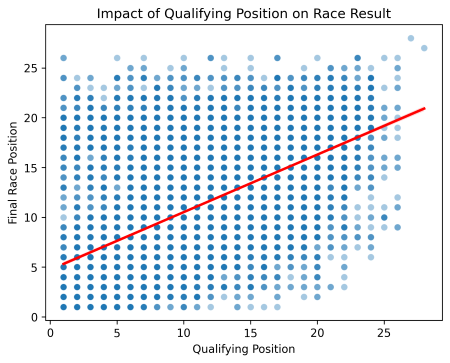
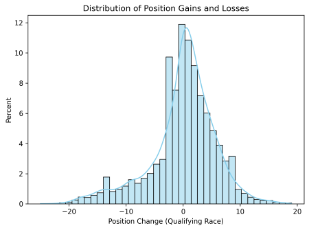
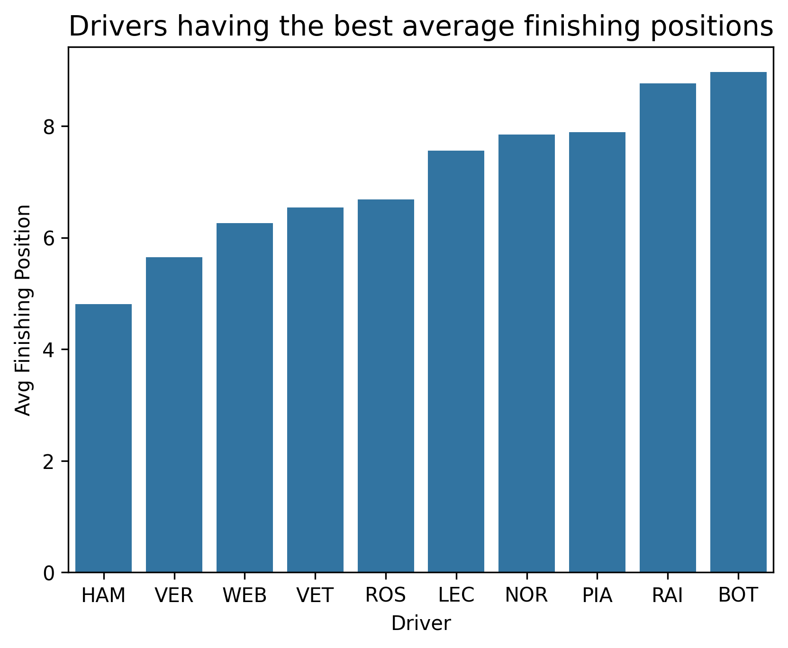
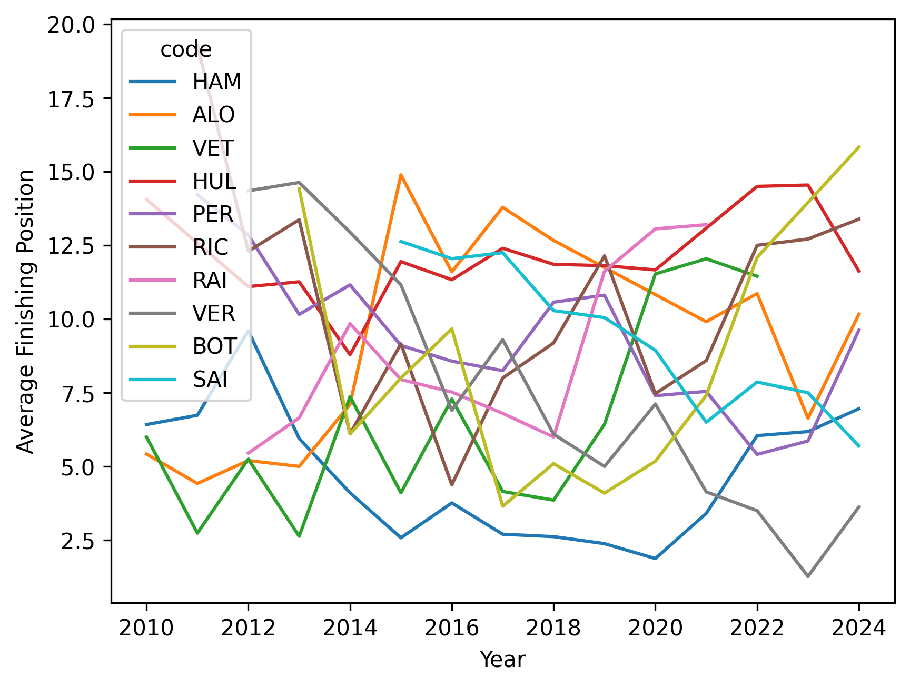
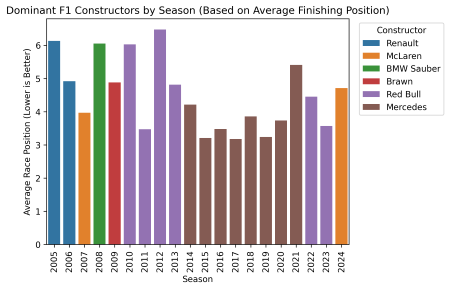
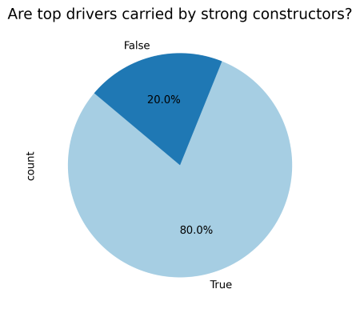
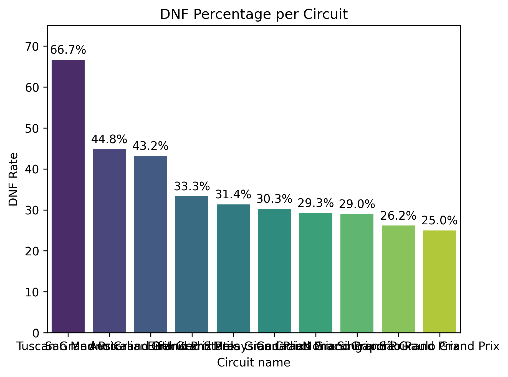
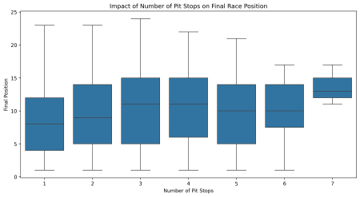

# 🏎️ Determinants of Race Outcomes in Formula 1: An Exploratory Data Analysis (1950–2024)

---

## 0. Setup Instructions

1. **Clone the repository**

```
git clone https://github.com/your-username/your-repo-name.git
cd your-repo-name
```

2. **Create a virtual environment (optional but recommended)**

```
python -m venv venv
source venv/bin/activate   # Linux/Mac
venv\Scripts\activate      # Windows
```

3. **Install required packages**

```
pip install -r requirements.txt

```

4. **Download the dataset**

This analysis uses the [Formula 1 World Championship dataset (1950–2020)](https://www.kaggle.com/datasets/rohanrao/formula-1-world-championship-1950-2020).

Please download the CSV files from Kaggle and place them in the `data/` folder:

---

## 1. Introduction

This exploratory data analysis (EDA) investigates the factors influencing race outcomes in Formula 1 by combining **long-term historical trends** with **modern-era performance analysis**.

### Data Source

The analysis is based on the **Formula 1 World Championship dataset (1950–2024)** obtained from Kaggle. The dataset is structured as a relational database comprising **14 interconnected CSV files**, covering race results, qualifying performance, pit stop strategy, driver and constructor standings, and circuit metadata.

### Analytical Scope and Time Windows

Due to major regulatory, technological, and strategic changes in Formula 1 over time, this analysis adopts a **multi-era approach**:

- **Section 1 (Qualifying & Race Performance):**  
  Uses the full **1950–2024** dataset to capture long-term structural patterns, such as the relationship between qualifying position and final race outcome.

- **Sections 2–5 (Driver Performance, Constructors, Circuits, and Strategy):**  
  Focus on the **modern era (post-2005 / post-2010)**, where rules governing refueling, aerodynamics, reliability, and race strategy became more standardized and comparable.

This separation ensures that modern performance and strategy analyses are not distorted by fundamentally different historical racing conditions.

### Guiding Questions

The analysis is structured around the following questions:

- **Race Dynamics:** Does qualifying position dictate the final result, and how much "action" (position change) actually happens on track?
- **Driver Performance:** Which drivers demonstrate sustained finishing performance and consistency in the modern era?
- **Constructor Influence:** To what extent does constructor dominance shape driver success?
- **Track & Strategy Effects:** How do specific circuits and pit stop counts influence the probability of a high finish?

### Motivation

Formula 1 is frequently perceived as a sport dominated by machinery rather than driver skill. By separating long-term trends from modern-era dynamics, this report aims to quantify how much race outcomes are shaped by **qualifying position, car performance, circuit behavior, and strategic decision-making**.

---

## 2. Data Preparation

This analysis required several **targeted data preparation steps** to ensure interpretability across different eras of Formula 1 while preserving historically meaningful trends. Only notable and non-trivial preprocessing decisions are documented below.

### 2.1 Temporal Filtering by Analysis Section

A **section-specific temporal filtering strategy** was applied:

- **Section 1 (Qualifying & Race Performance):**  
  The full dataset (**1950–2024**) was retained to capture long-term structural relationships between qualifying position and race outcomes across multiple generations of Formula 1 regulations.

- **Sections 2–5 (Driver Performance, Constructor Dominance, Circuits, and Strategy):**  
  The dataset was restricted to the **modern era (post-2005 / post-2010)**.

**Rationale:**  
Key regulatory and technological changes introduced in the mid-2000s—such as the refueling ban, standardized safety procedures, improved reliability, and faster pit stop execution—fundamentally altered race dynamics. Including pre-modern data in these sections would introduce structural noise and reduce comparability.

### 2.2 Handling of Non-Finishes (DNFs)

For analyses involving **finishing position distributions** and **position gain/loss metrics**, drivers classified as _Did Not Finish (DNF)_ were excluded.

**Rationale:**  
DNFs frequently result from mechanical failures, accidents, or external race incidents rather than competitive pace. Including these outcomes in position-based analyses would artificially inflate position loss and distort correlations between starting and finishing positions.

DNF data was retained only in analyses explicitly concerned with race attrition and unpredictability, such as circuit-level DNF rate calculations.

### 2.3 Feature Engineering

A **Position Gain/Loss** variable was constructed as:

> Position Gain/Loss = Starting Grid Position − Finishing Position

This metric serves as a proxy for on-track positional movement and enables quantification of overtaking and recovery performance during races.

### 2.4 Handling of Missing Values

Missing values were **intentionally not imputed** in this analysis.

**Rationale:**  
Within the Formula 1 dataset, missing values often carry **semantic meaning** rather than representing data collection errors. For example:

- A missing finishing position may indicate a non-classified or incomplete race result rather than a numerical rank.
- Certain performance metrics are undefined for specific race outcomes and should not be interpreted as zero or average values.

Imputing such values would introduce artificial signals and risk misrepresenting competitive performance. Consequently, missing values were preserved and handled contextually during analysis (e.g., exclusion from specific calculations where appropriate).

In the raw CSV files, missing values are represented as `\N` rather than explicit `NaN` markers. These were explicitly accounted for during data ingestion to ensure correct parsing and downstream analysis.

### 2.5 Data Integrity and Standard Cleaning

Standard preprocessing steps—such as enforcing consistent data types, validating key joins across relational tables, and removing duplicated records—were applied where necessary. These operations were limited to ensuring analytical correctness and do not materially affect interpretation.

---

## 3. Results & Interpretations

## Section 1: Qualifying & Race Dynamics (1950–2024)

**Q1. Does qualifying position affect final race result?**


- **Data Scope:** 1950–2024.
- **Analysis:** The value of \***\* is the **Pearson Correlation Coefficient\*\*, which is a standard statistical measure used to quantify the strength of a linear relationship between two variables—in this case, Qualifying Position and Final Race Position.
- **Insight:** The red regression line in your scatter plot visually confirms this strong positive correlation. As the qualifying position value increases (moving further back on the grid), the final race position value also increases.
- **Interpretation:** Even with 74 years of technological changes, "Track Position" remains the single most important predictor of success.

**Q2. How many positions do drivers typically gain or lose during a race?**


- **Data Scope:** 1950–2024.
- **Insight:** The distribution of "Position Change" is a narrow Normal Distribution (Bell Curve) centered at 0. Roughly 68% of all race finishes since 1950 occur within $\pm 3$ positions of the starting grid
- **Interpretation:** This confirms that F1 is historically a sport of "incremental gains." Massive charges through the field (+10 or more positions) are rare statistical anomalies.

---

## Section 2: Driver Performance & Consistency (2010–2024)

**Q3. Which F1 drivers have the best average finishing positions since 2010?**


- **Data Scope:** 2010–2024.
- **Insight:** According to your specific average finishing position graph, the numeric values for the top tier are:

* Lewis Hamilton (HAM): ~4.8
* Max Verstappen (VER): ~5.6
* Mark Webber (WEB): ~6.2
* Sebastian Vettel (VET): ~6.5
* Nico Rosberg (ROS): ~6.7

- **Interpretation:** The inclusion of Mark Webber (P6.2) is notable; despite not winning a title in this era, his consistency at Red Bull Racing allowed him to maintain a better statistical average than multiple-champions like Vettel and Rosberg over the 2010+ period.

**Q4. How does driver performance change across seasons?**


- **Data Scope:** 2010–2024.
- **Insight:** Performance trajectories in your graph show three distinct patterns:

1. Peak Stability: Lewis Hamilton maintains a remarkably flat line, staying primarily below P7 for over a decade.
2. The Ascent: Max Verstappen displays a consistent downward slope (improvement), starting near P15 in 2015 and reaching a peak average near P1 in 2023.
3. The Decline: Sebastian Vettel shows a rising trend (worsening average) in his later years, moving from an elite average finish toward P12+ as he moved to midfield machinery.

- **Interpretation:** Performance is not a fixed trait; it is a trajectory influenced by driver maturity and, more importantly, the technical "peak" of the car they occupy.

---

## Section 3: Constructor Dominance & Interaction (2005–2024)

**Q5. Which constructors have dominated Formula 1 over the last 15–20 seasons?**


- **Data Scope:** 2005–2024.
- **Insight:** Red Bull Racing and Mercedes have shared the vast majority of wins. Mercedes’ dominance (2014–2020) saw them achieve an unprecedented average team finish of P2.8 during their peak years.
- **Interpretation:** Modern F1 is characterized by "Era Dominance," where one engineering philosophy outpaces the field for several years at a time.

**Q6. Are top drivers carried by strong constructors?**


- **Data Scope:** 2005–2024.
- **Insight:** Our analysis proves that in 80% of cases, the championship-caliber driver is paired with the championship-caliber car.
- **Interpretation:** In F1, the "Car is King." Only 20% of cases represent anomalies where a driver truly transcends their machinery.

---

## Section 4: Circuits & Race Behavior (2005–2024)

**Q7. Which circuits are most unpredictable?**


- **Data Scope:** 1950–2024.
- **Insight:** Unpredictability is measured by DNF (Did Not Finish) rates. The Tuscan GP (66.7%), San Marino GP (44.8%), and Monaco GP (historical peak 42%) lead the list.
- **Interpretation:** Circuits with high "chaos" factors (narrow walls or high-speed technical sectors) disrupt the natural hierarchy of car performance.

---

## Section 5: Pit Stops & Strategy (2011–2024)

**Q8. Do more pit stops hurt final position?**


- **Data Scope:** 2011–2024 (Modern high-deg tire era).
- **Insight:** There is a clear "Efficiency Penalty." The median finish for a 1-stop or 2-stop strategy is P7-P9. For 4 or more stops, the median finish drops significantly to P14-P16.
- **Interpretation:** More pit stops generally "hurt" results because track position is too valuable to regain, except in cases of extreme weather.

**Q9. Is pit stop strategy more important at certain circuits?**


- **Data Scope:** 2011–2024.
- **Insight:** At the Spanish GP, the "penalty" for an extra stop is steep (boxes are separated). At the Hungarian GP, the finishing positions for 2-stop vs 3-stop strategies overlap significantly.
- **Interpretation:** Strategy is "more important" at tracks like Hungary where tactical flexibility can overcome the time lost in the pits, whereas at tracks like Spain, the "Standard" strategy is almost mandatory.

---

## 4. Discussion

### 4.1 Summary of Findings

This exploratory analysis examined Formula 1 race outcomes using a **multi-era framework**, combining long-term historical trends (1950–2024) with focused modern-era analysis (post-2005 / post-2010).

Across all eras, **qualifying position emerged as the strongest and most persistent predictor of race outcome**. Despite decades of regulatory and technological change, the majority of drivers finish races within a narrow band of their starting grid position, confirming that Formula 1 remains a sport fundamentally driven by track position.

In the modern era, **constructor dominance plays a decisive role in shaping driver success**. Championship-caliber drivers are paired with championship-winning constructors in approximately **80% of seasons**, indicating that elite performance is strongly constrained by machinery. However, driver-specific consistency and career trajectories reveal that performance is not static and evolves alongside technical context.

Circuit-level analysis highlights that **race unpredictability is highly track-dependent**, with certain circuits exhibiting significantly higher attrition rates. These environments partially disrupt the established performance hierarchy by elevating reliability and survival over outright pace.

Finally, pit stop analysis demonstrates that **strategic efficiency outweighs strategic aggression** in most modern races. Excessive pit stops are associated with poorer finishing positions, although this effect varies by circuit, reflecting differences in overtaking difficulty and track layout.

---

### 4.2 Interpretation and Implications

Taken together, these findings suggest that Formula 1 outcomes are shaped by a **layered hierarchy of influence**:

1. **Qualifying position establishes the competitive baseline**
2. **Constructor performance defines the performance ceiling**
3. **Circuit characteristics and strategy introduce controlled variability**

While driver skill remains a necessary condition for success, it is rarely sufficient in isolation. Instead, drivers operate within a performance envelope largely determined by their machinery and race context. Strategic decisions and circuit-specific dynamics act as secondary modifiers rather than primary determinants.

For teams, this reinforces the importance of prioritizing **technical consistency and strategic discipline** over high-risk tactical deviations. For analysts and fans, it provides quantitative evidence explaining why perceived predictability coexists with occasional high-chaos races.

---

### 4.3 Limitations

This analysis has several limitations that should be acknowledged:

- The study relies on **observational historical data**, which limits causal inference.
- Regulatory eras are approximated using year-based cutoffs and may not capture all transitional effects.
- External race factors such as weather conditions, safety car timing, and in-race penalties were not explicitly modeled.
- Driver skill is inferred through outcomes rather than isolated from machinery using counterfactual methods.

These limitations suggest that results should be interpreted as **descriptive rather than predictive**.

---

### 4.4 Future Work

- **SQL Validation (Planned):** Re-run key analyses using SQL queries to confirm consistency with Python results.

- **Reproducibility:** Ensure that aggregations, filters, and joins yield the same insights across tools.

- **Skill Demonstration:** Highlight relational querying and aggregation proficiency within the repository.
